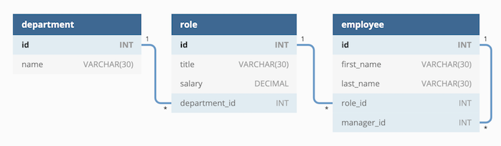

# Employee-CMS

This is a command-line application to manage a company's employee database, using Node.js, Inquirer, and MySQL.

## User Story

```md
AS A business owner
I WANT to be able to view and manage the departments, roles, and employees in my company
SO THAT I can organize and plan my business
```
## Schema Example

User inputs will create a database with the department - role - employee format: 



## Instructions

Download or clone repo, start mysql and set 'source data.sql', then 'CREATE DATABASE cms_db'.   
Install [MySQL2](https://www.npmjs.com/package/mysql2) to connect to your MySQL database and perform queries.  
Install [Inquirer](https://www.npmjs.com/package/inquirer) to interact with the user via the command line, and the [console.table package](https://www.npmjs.com/package/console.table) to print MySQL rows to the console.

Once set up, run node cms.js and fill in the prompts to build your database.

## Walkthrough Video

[Creating a CMS in VS code](https://www.youtube.com/watch?v=dnNJV5nx64U)


